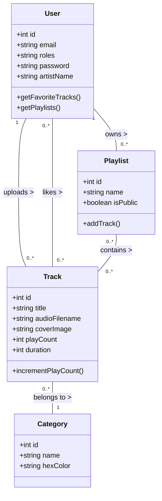
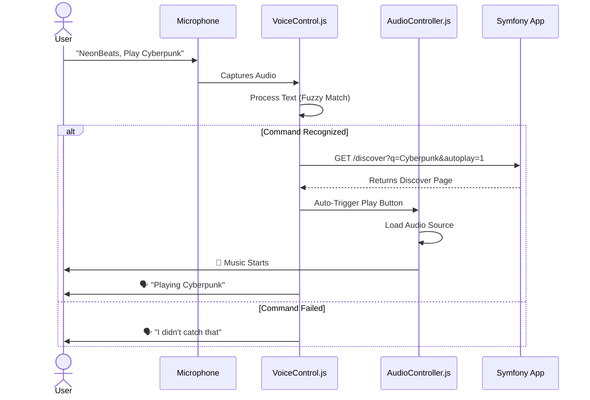

# 🎵 NeonBeats — Next-Gen Music Streaming Platform

> **University Project** | **Team:** Ayoub, Farah, Rakia

---

## 📖 Project Overview

**NeonBeats** is a modern, immersive web-based music streaming application built with a focus on user experience (`UX`), aesthetic design, and accessibility. It allows users to discover music, create playlists, and control playback using voice commands.

### 🌟 Key Features
- **Immersive UI:** A "Glassmorphism" design with dynamic 3D backgrounds (Three.js) and neon aesthetics.
- **Smart Voice Control:** A built-in AI assistant ("NeonVoice") to control music (Play, Pause, Skip, Volume) using voice commands.
- **Role-Based System:** Distinct dashboards for **Listeners** (Discovery/Playlists), **Artists** (Uploads/Analytics), and **Admins** (User/Content Management).
- **Interactive Player:** Persistent mini-player with Turbo Drive support for seamless audio during navigation.
- **Social Features:** Trending tracks, Favorites, and Play counts.

---

## 🛠️ Technical Stack

This project follows the **MVC (Model-View-Controller)** architectural pattern.

| Component | Technology | Description |
| :--- | :--- | :--- |
| **Backend** | **Symfony 7 (PHP 8.2)** | Robust framework for routing, security, and ORM. |
| **Database** | **MySQL** | Relational database for Users, Tracks, Playlists. |
| **Frontend** | **Twig + Tailwind CSS** | Responsive, utility-first styling engine. |
| **Interactivity** | **Stimulus + Turbo** | SPA-like navigation without full SPA complexity. |
| **3D Graphics** | **Three.js** | Interactive background particle systems. |
| **Voice AI** | **Web Speech API** | Native browser API for Speech-to-Text and TTS. |

---

## 📐 Architecture & Diagrams

### 1. Class Diagram (Data Structure)
This diagram illustrates the core entities and their relationships.



### 2. Sequence Diagram (Voice Command Flow)
How the Voice Assistant controls the playback system.



---

## 🤝 Project Realization & Team Split

To modularize the development, the project has been divided into **3 Core Modules**, assigned based on technical domain. Each module is further split into **2 logical commits** to organize the Git history.

```mermaid
graph TD
    Root[NeonBeats Project]
    
    subgraph Ayoub [👤 Ayoub: Integration & Deep Tech]
        A1[Commit 1: Logistics & Setup]
        A2[Commit 2: JS, AI & 3D Dev]
    end
    
    subgraph Farah [👤 Farah: Backend Development]
        F1[Commit 3: Core Logic (src)]
        F2[Commit 4: API & Security]
    end
    
    subgraph Rakiya [👤 Rakiya: Frontend & Templating]
        R1[Commit 5: HTML Structure]
        R2[Commit 6: View Implementation]
    end

    Root --> Ayoub
    Root --> Farah
    Root --> Rakiya

    A1 --> "Project Init, Configuration, Integration Logistics"
    A2 --> "JS Components, AI Voice API, Three.js 3D Engine"
    
    F1 --> "PHP Business Logic, Entities, Controllers (src/)"
    F2 --> "Auth Security, Migrations, Backend Services"
    
    R1 --> "Twig Templates, Base Layouts, Tailwind Integration"
    R2 --> "Dashboard UI, Track List Templates, Admin Views"
```

### 📋 Detailed Commit Plan (for Git History)

If you are reconstructing the history, follow this order:

#### **👤 Part 1: Ayoub (The Integrator)**
*   **Commit 1: "Project Foundation & Logistics"**
    *   *Files:* `.env`, `composer.json`, `package.json`, `docker-compose.yml`, Integration configs.
    *   *Goal:* Initialize the project, manage dependencies, and setup development logistics.
*   **Commit 2: "Advanced Interactivity: JS, AI & 3D"**
    *   *Files:* `assets/controllers/*`, `assets/three_bg.js`, `assets/voice_control.js`.
    *   *Goal:* Build the "Deep Tech" components (Voice Recognition, 3D Graphics, JS logic).

#### **👤 Part 2: Farah (The Backend Architect)**
*   **Commit 3: "Core Backend & Business Logic"**
    *   *Files:* `src/Entity/*`, `src/Controller/*`, `src/Repository/*`.
    *   *Goal:* Implement the core PHP functionality and database relationships in the `src` folder.
*   **Commit 4: "Security & System Services"**
    *   *Files:* `src/Security/*`, `config/packages/security.yaml`, Backend Mailers/Services.
    *   *Goal:* Secure the application and implement complex backend workflows.

#### **👤 Part 3: Rakiya (The Frontend Developer)**
*   **Commit 5: "Frontend Structure & Templating"**
    *   *Files:* `templates/base.html.twig`, `templates/partials/*`, `templates/home/*`.
    *   *Goal:* Develop the HTML structure and responsive layouts using Twig.
*   **Commit 6: "View Implementation & UI Refinement"**
    *   *Files:* `templates/admin/*`, `templates/track/*`, `templates/playlist/*`.
    *   *Goal:* Complete all functional views and finalize the user-facing HTML components.

---

## 🚀 How to Run

1.  **Install Dependencies:**
    ```bash
    composer install
    npm install
    ```
2.  **Database Setup:**
    ```bash
    php bin/console doctrine:database:create
    php bin/console doctrine:migrations:migrate
    ```
3.  **Build Assets:**
    ```bash
    npm run build
    ```
4.  **Start Server:**
    ```bash
    symfony server:start
    ```
