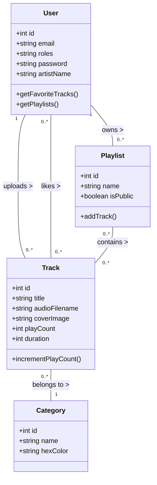
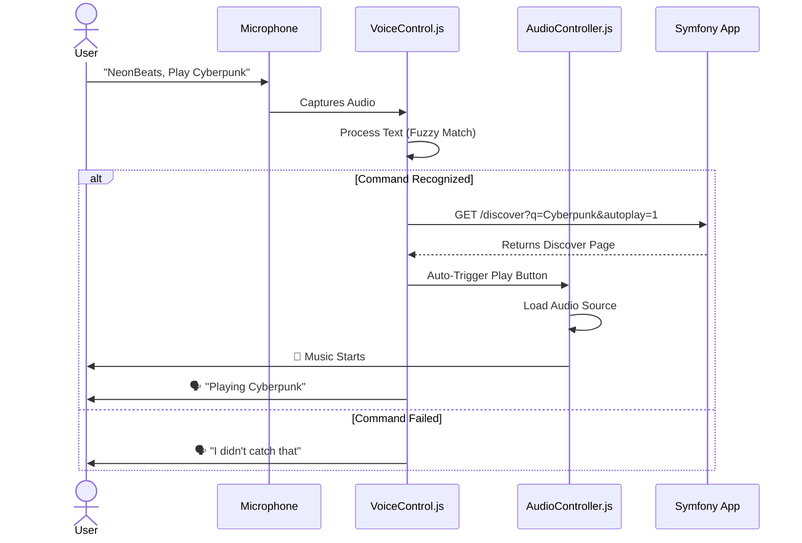

# 🎵 NeonBeats — Next-Gen Music Streaming Platform

> **University Project** | **Team:** Ayoub, Farah, Rakia

---

## 📖 Project Overview

**NeonBeats** is a modern, immersive web-based music streaming application built with a focus on user experience (`UX`), aesthetic design, and accessibility. It allows users to discover music, create playlists, and control playback using voice commands.

### 🌟 Key Features
- **Immersive UI:** A "Glassmorphism" design with dynamic 3D backgrounds (Three.js) and neon aesthetics.
- **Smart Voice Control:** A built-in AI assistant ("NeonVoice") to control music (Play, Pause, Skip, Volume) using voice commands.
- **Role-Based System:** Distinct dashboards for **Listeners** (Discovery/Playlists), **Artists** (Uploads/Analytics), and **Admins** (User/Content Management).
- **Interactive Player:** Persistent mini-player with Turbo Drive support for seamless audio during navigation.
- **Social Features:** Trending tracks, Favorites, and Play counts.

---

## 🛠️ Technical Stack

This project follows the **MVC (Model-View-Controller)** architectural pattern.

| Component | Technology | Description |
| :--- | :--- | :--- |
| **Backend** | **Symfony 7 (PHP 8.2)** | Robust framework for routing, security, and ORM. |
| **Database** | **MySQL** | Relational database for Users, Tracks, Playlists. |
| **Frontend** | **Twig + Tailwind CSS** | Responsive, utility-first styling engine. |
| **Interactivity** | **Stimulus + Turbo** | SPA-like navigation without full SPA complexity. |
| **3D Graphics** | **Three.js** | Interactive background particle systems. |
| **Voice AI** | **Web Speech API** | Native browser API for Speech-to-Text and TTS. |

---

## 📐 Architecture & Diagrams

### 1. Class Diagram (Data Structure)
This diagram illustrates the core entities and their relationships.



### 2. Sequence Diagram (Voice Command Flow)
How the Voice Assistant controls the playback system.



---

## 🤝 Project Realization & Team Split

To modularize the development, the project has been divided into **3 Core Modules**, assigned to specific team members. Each module is further split into **2 logical commits** to organize the Git history.

```mermaid
graph TD
    Root[NeonBeats Project]
    
    subgraph Ayoub [👤 Ayoub: Core Infrastructure & Logic]
        A1[Commit 1: Setup & Data Layer]
        A2[Commit 2: Advanced Features]
    end
    
    subgraph Rakia [👤 Rakia: Content & Interaction]
        R1[Commit 3: Content Management]
        R2[Commit 4: Personalization]
    end
    
    subgraph Farah [👤 Farah: Design & Experience]
        F1[Commit 5: UI/UX Foundation]
        F2[Commit 6: Visual Polish]
    end

    Root --> Ayoub
    Root --> Rakia
    Root --> Farah

    A1 --> "Symfony Init, User Entity, Auth Security"
    A2 --> "Voice Assistant JS, Admin Dashboard"
    
    R1 --> "Track/Category Entities, Upload Forms"
    R2 --> "Playlist System, Favorites, Likes"
    
    F1 --> "Tailwind Config, Base Layouts, Homepage"
    F2 --> "Three.js Background, Player UI, Animations"
```

### 📋 Detailed Commit Plan (for Git History)

If you are reconstructing the history, follow this order:

#### **👤 Part 1: Ayoub (The Architect)**
*   **Commit 1: "Init Project core and Authentication"**
    *   *Files:* `.env`, `docker-compose.yml`, `security.yaml`, `User.php`, `RegistrationController.php`, `LoginController.php`.
    *   *Goal:* Get the server running and users logging in.
*   **Commit 2: "Implement Voice Assistant and Admin Panel"**
    *   *Files:* `assets/voice_control.js`, `AdminController.php`, `templates/admin/*`.
    *   *Goal:* Add the "Brain" of the site and the control center.

#### **👤 Part 2: Rakia (The Functional Logic)**
*   **Commit 3: "Add Content Management (Tracks & Categories)"**
    *   *Files:* `Track.php`, `Category.php`, `TrackController.php`, `templates/track/new.html.twig`.
    *   *Goal:* Allow uploading music and organizing genres.
*   **Commit 4: "Add User Interaction (Playlists & Favorites)"**
    *   *Files:* `Playlist.php`, `PlaylistController.php`, `favorites.html.twig`.
    *   *Goal:* Let users save music and create their own collections.

#### **👤 Part 3: Farah (The Designer)**
*   **Commit 5: "Setup UI Design System"**
    *   *Files:* `tailwind.config.js`, `base.html.twig`, `home/index.html.twig`.
    *   *Goal:* Define the look, feel, fonts, and responsive layout.
*   **Commit 6: "Enhance Visuals & Player Experience"**
    *   *Files:* `assets/three_bg.js`, `assets/controllers/audio_player_controller.js`, `discover.html.twig`.
    *   *Goal:* Add the 3D particles, the glass player, and the smooth animations.

---

## 🚀 How to Run

1.  **Install Dependencies:**
    ```bash
    composer install
    npm install
    ```
2.  **Database Setup:**
    ```bash
    php bin/console doctrine:database:create
    php bin/console doctrine:migrations:migrate
    ```
3.  **Build Assets:**
    ```bash
    npm run build
    ```
4.  **Start Server:**
    ```bash
    symfony server:start
    ```
